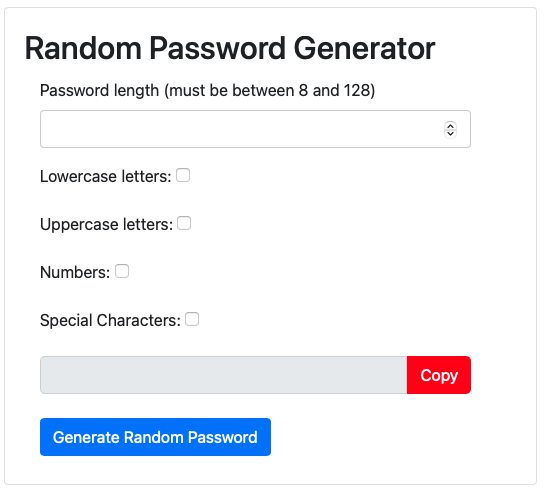
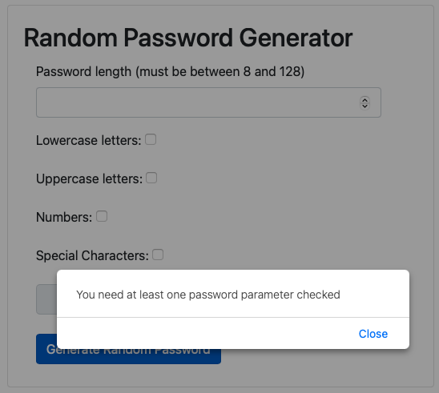
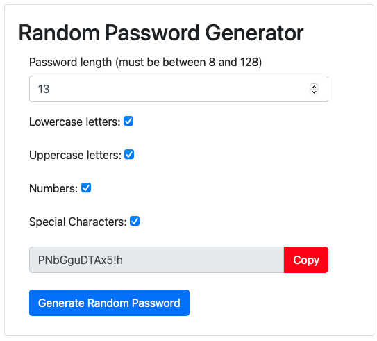
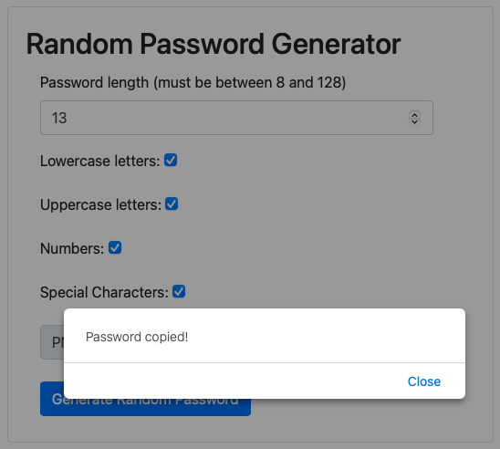

Random Password Generator

This project involved html, css, and javscript in order to create a random passwrod generator.  Instead of using prompts to the screen for userinput, I provided a GUI for the user to select the paramters they want for their password.  This locks down options to prevent user input that would break the application.  In the event they forget to click a checkmark for the parameters, the user will receive an alert saying the need to check at least one.  Once generated, there is a button to copy the password to their clipboard. Overall, I am happy with the result of this applcation.  It works as intended.  

WHen you land on the page, it will look like this: 

If you try and generate a password without entering a number between 8 and 128 and have at least one of the other parameters checked, you wil receive an error like this: 
 

To generate a password select a number, and check at least on box, then click generate password, you will see in the textbox at the bottom that a password is generated.  

Once generated, click the "copy" button and it will alert a message saying your password has been copied.  

